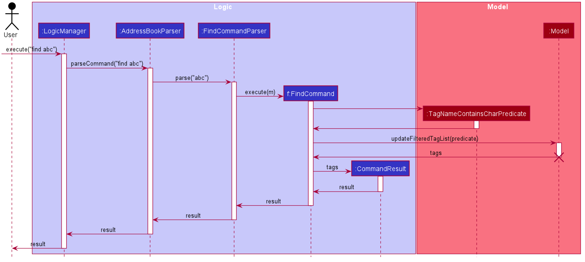

## Project: HelloFile

HelloFile is a file management application created as an extension to AddressBook - Level 3 (AB3),
specifically made for tech savvy CS2103T CS students.
By using HelloFile, students can tag frequently used files/folders with a short nickname, and open their files
with intuitive commands.

Given below are my contributions to the project.

* **New Feature**: Create the model of the app, by including `Tag`, `Label`, `FileAddress`, and `CurrentPath` class.
(Pull request [\#81](https://github.com/AY2021S1-CS2103T-F12-1/tp/pull/81)) 
  * What it does: allows developers to have a strong architecture to continue the app development.
  * Justification: This feature improves the product significantly because these models are the keys to the continuation of the app.
  * Highlights: This enhancement affects the current AddressBook Level 3 at that point. So a lot of modification and refactoring were made on that period.
  * Credits: This enhancement was developed upon the AddressBook Level 3 model class, with some classes being modified and some class being removed.
  
  
* **Code contributed**: [RepoSense link](https://nus-cs2103-ay2021s1.github.io/tp-dashboard/#breakdown=true&search=&sort=groupTitle&sortWithin=title&since=2020-08-14&timeframe=commit&mergegroup=&groupSelect=groupByRepos&checkedFileTypes=docs~functional-code~test-code~other&tabOpen=true&tabType=authorship&zFR=false&tabAuthor=HynRidge&tabRepo=AY2021S1-CS2103T-F12-1%2Ftp%5Bmaster%5D&authorshipIsMergeGroup=false&authorshipFileTypes=docs~functional-code~test-code)

* **Project management**:
  * Keep track of the milestone's deadline on each iteration.

* **Enhancements to existing features**:
  * Updated the HelpCommand to show details of specific command  (Pull requests [\#186](https://github.com/AY2021S1-CS2103T-F12-1/tp/pull/186))
  * Updated the FindCommand to be case insensitive (Pull requests [\#207](https://github.com/AY2021S1-CS2103T-F12-1/tp/pull/207))
  
* **Documentation**:
  * User Guide (UG):
    * Added documentation for the features `label` and `find` [\#169](https://github.com/AY2021S1-CS2103T-F12-1/tp/pull/169)
    * Added `help COMMAND` in Features section [\#210](https://github.com/AY2021S1-CS2103T-F12-1/tp/pull/210)
    * Added screenshots in the User Interface section. [\#212](https://github.com/AY2021S1-CS2103T-F12-1/tp/pull/212)
    * Added some screenshots for the Basic Workflow section. [\#214](https://github.com/AY2021S1-CS2103T-F12-1/tp/pull/214)
    * Added Glossary section [\#308](https://github.com/AY2021S1-CS2103T-F12-1/tp/pull/308)
    
  * Developer Guide(DG):
    * Added description for features `Tag` class and `Label` class [\#164](https://github.com/AY2021S1-CS2103T-F12-1/tp/pull/164)
    * Updated User Stories section [\#173](https://github.com/AY2021S1-CS2103T-F12-1/tp/pull/173).
    * Add an UML in the Implementation section[\#317](https://github.com/AY2021S1-CS2103T-F12-1/tp/pull/317)

* **Community**:
  * PRs reviewed (with non-trivial review comments):
    [\#162](https://github.com/AY2021S1-CS2103T-F12-1/tp/pull/162),
    [\#206](https://github.com/AY2021S1-CS2103T-F12-1/tp/pull/206), 
    [\#213](https://github.com/AY2021S1-CS2103T-F12-1/tp/pull/213),
    [\#269](https://github.com/AY2021S1-CS2103T-F12-1/tp/pull/269),   
  * Contributed to forum discussions (examples: [1](https://github.com/nus-cs2103-AY2021S1/forum/issues/82), 
    [2](https://github.com/nus-cs2103-AY2021S1/forum/issues/70), 
    [3](https://github.com/nus-cs2103-AY2021S1/forum/issues/19), 
    [4](https://github.com/nus-cs2103-AY2021S1/forum/issues/18))
  * Reported bugs and suggestions for other teams in the class (examples: [1](https://github.com/HynRidge/ped/issues/5), 
    [2](https://github.com/HynRidge/ped/issues/4), 
    [3](https://github.com/HynRidge/ped/issues/3),
    [4](https://github.com/HynRidge/ped/issues/2))
    
## Contributions to the User Guide  (Extract)

### 4.8 Finding a tag : `find`

Finds a tag by its keyword (can be tag name and/or label).

Format: `find KEYWORD`

Examples:
* `find notes`

## 7. Glossary

Terminology | Definition
--------------|------------------
**CLI** | Command Line Interface is a command line program that accepts text input to execute operating system functions
**GUI** | Graphical User Interface is a form of user interface that allows users to interact with electronic devices through graphical icons, instead of text-based user interfaces.
**Absolute path** | The complete address of a file location. Usually, the address consists of the root element and the complete directory list required to locate the file Example: `C:\Users\a.txt` (Windows), `/home/usr/b.txt` (Linux)).
**Relative path** | The partial address of a file location. Usually, the address does not consist root element. Example: `./Users/Files/a.txt`,

 

## Contributions to the Developer Guide (Extract)

### User stories

Priorities: High (must have) - `* * *`, Medium (nice to have) - `* *`, Low (unlikely to have) - `*`

| Priority | As a …​                                                     | I want to …​                                       | So that I can…​                                            |
| -------- | ---------------------------------------------------------------| ------------------------------------------------------| --------------------------------------------------------------|
| `* * *`  | Student with lots of file                                      | tag my files with a easy to remember tag              | get file path                                                 |
| `* * *`  | First time user                                                | use a help command                                    | start to remember how to use the command                      |
| `* * *`  | Student who prefers to type                                    | use typing to interact with my file system            | use keyboard as much as possible                              |
| `* * *`  | Student who is familiar with command line applications         | name my files                                         | access the file easily next time                              |
| `* * *`  | CS student with many categories of files                       | categorise my files and folders                       | easily manage my files and search files based on categories   |
| `* * *`  | First time user                                                | use help command                                      | start to remember how to use the command                      |
| `* * *`  | Student with lots of files                                     | see a list of my tags                                 | find the tag that I created easily                            |
| `* * *`  | Developer                                                      | open files with a quick command                       | focus on coding and not look to find my files                 |
| `* *`    | CS student with a lot of project                               | hide private contact details                          | minimize chance of someone else seeing them by accident       |
| `* *`    | Command line user                                              | use commands similar to Linux                         | use the similar Linux command without having to relearn       |
| `*`      | Forgetful user who always forget where his files are located   | tag frequently used files with a easy to remember tag | locate my files easily                                        |
| `*`      | Intermediate user                                              | delete file                                           | not be distracted by it.                                      |

### Find a specific tag: FindCommand

...(after some description)

This is the sequence diagram of the FindCommand.   

