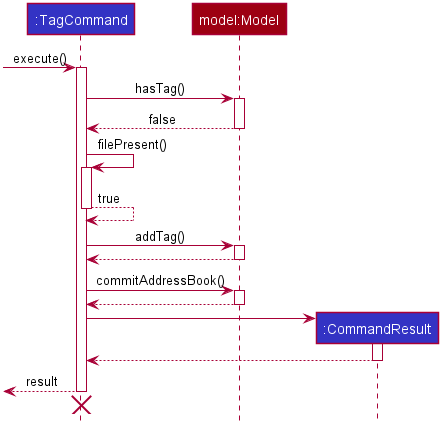
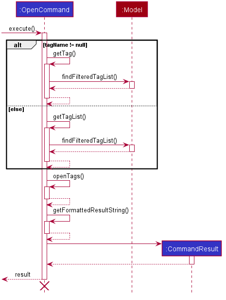

## Project: HelloFile

HelloFile is a file management application created as an extension to AddressBook - Level 3 (AB3),
specifically made for tech savvy CS2103T CS students.
By using HelloFile, students can tag frequently used files/folders with a short nickname, and open their files
with intuitive commands.

Given below are my contributions to the project.

* **New Feature**: Added the `tag` command
(Pull request [\#86](https://github.com/AY2021S1-CS2103T-F12-1/tp/pull/86))
  * What it does: Allows user to add a new tag to be saved in HelloFile.
  * Justification: This feature allows users to save a tag in HelloFile to be opened later, therefore making opening
  files easier for them.
  * Credits: This feature was built from AB3's `add` method.
  It was refactored to add tag into the model instead of person.
  
* **New Feature**: Added the ability to open files using a `tag`.
(Pull request [\#91](https://github.com/AY2021S1-CS2103T-F12-1/tp/pull/91))
  * What it does: Allows user to open previously saved tags using a tag.
  * Justification: This feature is central to our product, since we want users to be able to save the location of their
  files and open them with a short command.
  * Highlights: The feature is interesting to implement as JavaFX freezes in a Linux environment when the library method
  `java.awt.Desktop.getDesktop().open()` is invoked. I suspect the reason is that this method blocks the thread
  that JavaFX's UI is running on. The solution that was implemented is running the `open()` method on a different thread.
  (Bug fix pull request [\#216](https://github.com/AY2021S1-CS2103T-F12-1/tp/pull/216))
  
* **New Feature**: Added the ability to open files using a `label`
(Pull request [\#194](https://github.com/AY2021S1-CS2103T-F12-1/tp/pull/194)))
  * What it does: Allows user to open previously saved tags using a tag, thereby opening multiple files at the same time.
  * Justification: This feature improves the product significantly as it allows users to open multiple files that they
  need at the same time.
  * Highlight: This feature is an add-on to the open feature implemented earlier in the development cycle. I refactored
  out the `openTags` method to make the code cleaner and more maintainable.
  
* **New Feature**: Added the ability to undo/redo previous commands.
(Pull requests [\#183](https://github.com/AY2021S1-CS2103T-F12-1/tp/pull/183),
[\#184](https://github.com/AY2021S1-CS2103T-F12-1/tp/pull/184))
  * What it does: Allows the user to undo all previous commands one at a time. Preceding undo commands can be reversed
  by using the redo command.
  * Justification: This feature improves the product significantly because a user can make mistakes in using commands,
  and the app should provide a convenient way to rectify them.
  * Highlights: This enhancement affects existing commands and commands to be added in the future.
  Through discussion with the team, we have decided on the commands that can be undone and redone.
  * Credits: Original implementation is from [AddressBook Level 4](https://github.com/se-edu/addressbook-level4).
  Made some changes to adapt the implementation to HelloFile's model and commands.

* **Code contributed**: [RepoSense link](https://nus-cs2103-ay2021s1.github.io/tp-dashboard/#breakdown=true&search=&sort=groupTitle&sortWithin=title&since=2020-08-14&timeframe=commit&mergegroup=&groupSelect=groupByRepos&checkedFileTypes=docs~functional-code~test-code~other&tabOpen=true&tabType=authorship&zFR=false&tabAuthor=luo-git&tabRepo=AY2021S1-CS2103T-F12-1%2Ftp%5Bmaster%5D&authorshipIsMergeGroup=false&authorshipFileTypes=docs~functional-code~test-code~other)

* **Project management**:
  * Maintained release for `v1.3`.
  * Maintaining team tasks together with other team members.

* **Enhancements to existing features**:
  * Update CLI syntax to match HelloFile.
  (Pull requests [\#83](https://github.com/AY2021S1-CS2103T-F12-1/tp/pull/83),
  [\#267](https://github.com/AY2021S1-CS2103T-F12-1/tp/pull/267))
  * Update Tag and TagCommand to use absolute file path.
  (Pull request [\#153](https://github.com/AY2021S1-CS2103T-F12-1/tp/pull/153))
  * Add more predicates to enhance `FindCommand` to find characters instead of words.
  (Pull request [\#118](https://github.com/AY2021S1-CS2103T-F12-1/tp/pull/118))
  * Write additional tests to increase test coverage.
  (Pull requests [\#189](https://github.com/AY2021S1-CS2103T-F12-1/tp/pull/189),
  [\#268](https://github.com/AY2021S1-CS2103T-F12-1/tp/pull/268))

* **Documentation**:
  * User Guide (UG):
    * Add documentation for command summary. [\#27](https://github.com/AY2021S1-CS2103T-F12-1/tp/pull/27)
    * Update UG with more information such as longer introduction and more descriptive guides for commands. [\#213](https://github.com/AY2021S1-CS2103T-F12-1/tp/pull/213)
  * Developer Guide (DG):
    * Update DG Diagrams and include `TagCommand`, `OpenCommand` implementation details. [\#154](https://github.com/AY2021S1-CS2103T-F12-1/tp/pull/158)
  * Proof reading:
    * Proof read UG and DG and correct mistakes. [\#177](https://github.com/AY2021S1-CS2103T-F12-1/tp/pull/177)

* **Contribution to Team-based Tasks**
  * Made a logo for HelloFile to be used in UG and presentations.

* **Community**:
  * PRs reviewed (with non-trivial review comments):
  [\#193](https://github.com/AY2021S1-CS2103T-F12-1/tp/pull/193),
  [\#81](https://github.com/AY2021S1-CS2103T-F12-1/tp/pull/81),
  [\#285](https://github.com/AY2021S1-CS2103T-F12-1/tp/pull/285),
  [\#276](https://github.com/AY2021S1-CS2103T-F12-1/tp/pull/276)
  * Contributed to forum discussions
  (examples: [1](https://github.com/nus-cs2103-AY2021S1/forum/issues/370),
  [2](https://github.com/nus-cs2103-AY2021S1/forum/issues/312),
  [3](https://github.com/nus-cs2103-AY2021S1/forum/issues/271),
  [4](https://github.com/nus-cs2103-AY2021S1/forum/issues/374))
  * Reported bugs and suggestions for other teams in the class
  (examples: [1](https://github.com/luo-git/ped/issues/5),
  [2](https://github.com/luo-git/ped/issues/3),
  [3](https://github.com/luo-git/ped/issues/6))

## Contributions to the User Guide (Extract)

As the information age encroaches out lives, our digital footprint has become larger and larger.
When we accumulate many files from work, school and daily lives,
we tend to spend a lot of time locating the files that we need.
In an Internation Data Corporation (IDC) [white paper](https://denalilabs.com/static/ProductivityWhitepaper.pdf)
published in 2012, a survey of 1200 information workers and IT professionals around the world
shows that they spend an average of 4.5 hours a week looking for documents. That is a lot of productivity time wasted!
This is where our solution, HelloFile, comes in.

*HelloFile* is a desktop application for professionals who have to manage a lot of files, specifically **tech savvy CS2103T CS students**.
It is optimised for use under Command Line Interface (CLI).
By using our application, you can tag frequently used files/folders with a short nickname, and open them
with a single command. We hope by using our application, you can manage your files easily. You can
make your life easier one file at a time, and free up your precious time to spend on things you truly enjoy.

## Contributions to the Developer Guide (Extract)

### Adding of Tags: TagCommand

[TagCommand](https://github.com/AY2021S1-CS2103T-F12-1/tp/blob/master/src/main/java/seedu/address/logic/commands/TagCommand.java) 
adds a new `Tag` to `AddressBook` if the tag's `TagName` is not a duplicate and the tag's `FileAddress`
is pointing to a valid file. 
Moreover, TagCommand checks if the file is present before adding the tag to `Model`.

This diagram shows a successful execution of `TagCommand`, resulting in a new tag added to `Model`.

This diagram shows an unsuccessful execution of `TagCommand`, resulting in `CommandException` thrown.
In this case, the file was not present. 

`TagCommand` checks if the file address given is absolute or relative file path.
If the address is relative, it converts the relative path to absolute address by concatenating the relative
path to the current path stored in `Model`.
We designed `TagCommand` this way so that the users can use our File Explorer interface to navigate to
a folder, then tag files using relative file addresses.

### Opening of Tags: OpenCommand

[OpenCommand](https://github.com/AY2021S1-CS2103T-F12-1/tp/blob/master/src/main/java/seedu/address/logic/commands/OpenCommand.java)
accepts either a `Tag` or a `Label`.
It filters the list of `Tags` stored in `AddressBook` by the `Tag` or `Label` supplied, and generate a list of `Tag`
to be opened.
After that, it opens the files located at the `Tag`'s `FileAddress` if the file is present and user has read permission.
`CommandException` is thrown if tag is not present, the file cannot be found or no read permission.

This sequence diagram shows a successful execution of `OpenCommand`.  

We implemented OpenCommand using `java.awt.Desktop`,
which supports various desktop capabilities such as `open()`. `Desktop` ensures that our application can operation across
most java-supported platforms, hence fulfilling our product's requirement to be platform independent.

However, there are some significant drawback of using `java.awt.Desktop`. The platform that HelloFile operates on must
support `Desktop`. This means that our application will never work on a headless environment. 
As a developer, you can check whether the environment supports `Desktop`
using the library method `java.awt.Desktop.isDesktopSupported()`.

Another drawback is that `java.awt.Desktop.open()` blocks the JavaFX thread and causes the UI to freeze in non-Windows
environment. We believe this is due to concurrency issue related to JavaFX.
Regretfully, we have yet to find an elegant solution for this problem after consulting our professor.
The current solution is running `Desktop.open()` on a separate thread, which solves the problem.
We have tested this command under Windows and Ubuntu Linux.
